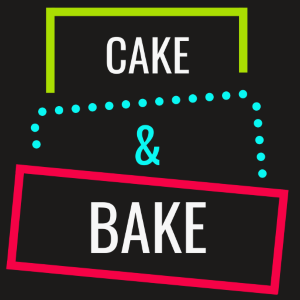
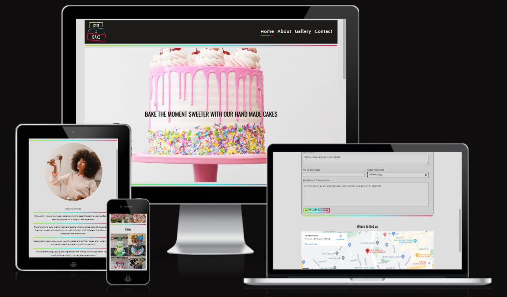
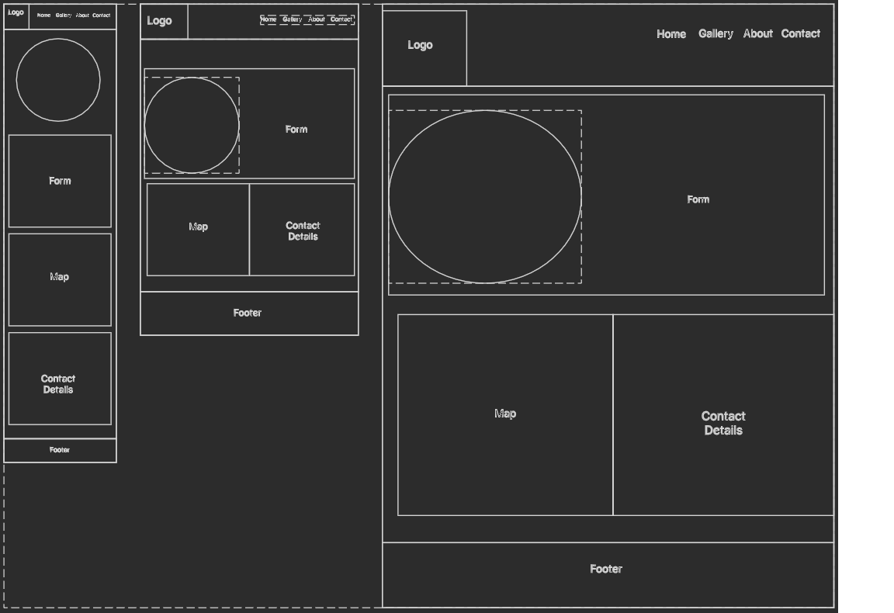
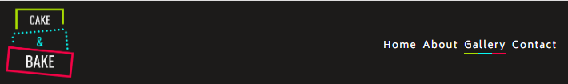
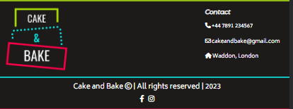
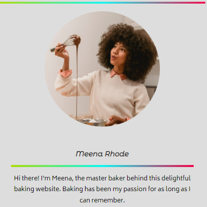
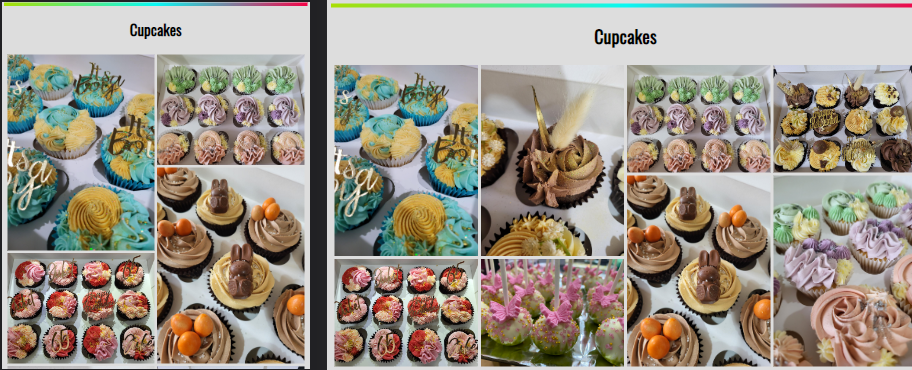
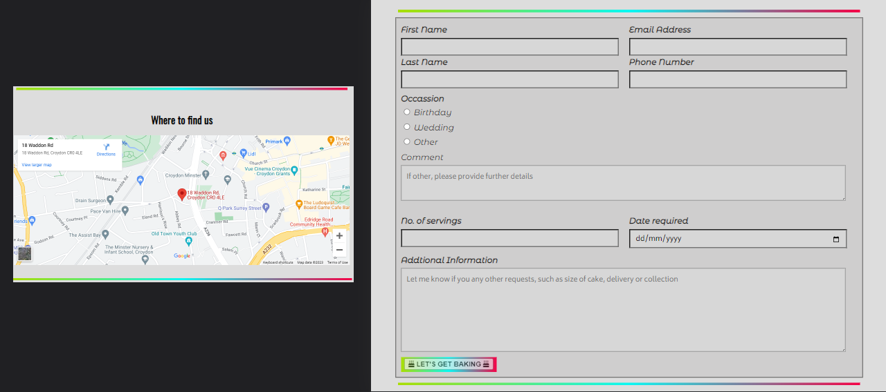

 

# __Portfolio Project 1 - HTML and CSS__
## __Cake and Bake__

Meena Rhodes is a part time baker working out of her own home in South Croydon, London, UK. She has been creating delicious delights for over a decade and built an impressive home business. She is active on [Instagram](https://www.instagram.com/cakeandbakeldn/?hl=en) and has built a following of just over 700 people. 

Meena is often asked by her clients if she has a website that can be shared with potential clients. As a result she is seeking the design and development of a functioning website that will showcase her work and allow potential clients to get in touch.

The first stage of this website will be to develop a HTML/CSS based website that meets user experience objectives set out in this document.

### __Demo__

The live site can be viewed here - [Cake & Bake](https://cmed01.github.io/Portfolio-Milestone-1/)

Github repository can be viewed here - [CMed01/Portfolio-Milestone-1](https://github.com/CMed01/Portfolio-Milestone-1)

 

## Table of Contents
* [User Experience](#user-experience)
* [Technologies](#technologies)
* [Testing](#testing)
* [Deployment](#deployement)
* [Credits](#credits)

## __User Experience__

### __Strategy__

The aim for this website is to provide a platform to showcase her work and grow her business. 

Reasons for the site
* Self-promotion
* Showcase successful baking projects
* To help clients get in touch with her

 

#### __User Stories__

- #### First Time Visitor Goals

    1. As a first time visitor, I want to understand the main purpose of the site and learn more about the business/organisation.
    2. As a first time visitor, I want to easily navigate throughout the site to find content
    3. As a first time visitor, I want to navigate and view a gallery of cakes, cupcakes and other cake related items.
    4. As a first time visitor, I want to be able to get in contact with the business.

- #### Returning Visitor Goals

    1. As a returning visitor, I want to be able to access and view the gallery easily.
    2. As a returning visitor, I want to be able to contact the business and request a service.

- #### Frequent User Goals

    1. As a frequent user, I want to be able to access and view the gallery and the business's social media links. Both will allow me to keep up to date with new baking projects.
    2. As a frequent user, I want to be able to contact the business and request a service.

 

### __Scope__

Functionally, the site must be:
* easy to navigate
* well presented and display an array of successful projects showcasing the talent of the baker.

Content should include the following:
* Provide the client information about who we are and what we do.
* Showcase the variety of our work.
* Provide testimonials from our clients.
* Link to social media pages.
* Provide a simple process to get in touch by phone, email, social media or via a contact form.

 

### __Structure__

Based on content required in the scope of this project, this website will consist of 4 pages

* Home page - hero image of Meena's work and description of the types of products on offer.
* About me page - action photo of Meena and information about who she is and her story behind baking.
* Gallery page - a selection of photos, ideally in sections, showcasing her work.
* Contact page - location of the business and contact form.

 

### __Skelton (Wireframes)__

Three images - mobile, tablet and laptops

1. #### Index Page

 

2. #### About Page

 

3. #### Gallery Page

 

4. #### Form Page

 

#### __Changes to wireframes__
Changes to the design were made during the build process in order to meet the project deadline and deliver a MVP.
- Changed layout of images and description on the index page and about me page for laptop and tablets screens.
- Removed 3 columns from the photos on the gallery page.
- CHanged the layout of the form and image on the contact me page for laptop screens.
- Removed contact section from form page as contact details present in the footer.

 

### __Surface (including Features)__

#### __Color scheme__

 

#### __Typography__
Three fonts were used throughout this website
1. 'Oswald' (back-up sans-serif) - used for all heading 1 and 2
2. 'Montserrat Alternates' (back-up sans-serif) - used for sll heading 3-6 and labels elements 
3. 'Biryani' (back-up sans-serif) - used for all other elements

 

#### __Features__

* Navigation bar
    - The navigation bar has a consistent look across all pages. It contains a logo of the company and links to all the other pages in the website. The menu link of the active page contains a bottom border and when hovered over, a dynamic colour change should occur. The colour of these should be consistent with the colour scheme of the website.

 

 

* Home page
    - The home page includes a hero image with text overlay, both of which simply provide an overview of the business and its goals. 
    - Information regarding the cake options that can be provided are in sections below the hero image
    - At the bottom of the page there is a testimonial section, providing recent feedback on the products available.

 

 

* Footer
    - The footer includes the business logo, contact details (phone, address, email) and links to all active social media pages (Facebook and Instagram).
 

 

* About me page
    - Continued use of the colour scheme throughout. The about me page provides an action image with a biography.

 

 

* Gallery page
    - The gallery page contains stand out photos of completed baking projects, showcasing what is on offer. There is a minimum of two sections, each 8 photos. The layout will be responsive initially with 2 columns on smaller screens progressing to 4 columns on larger devices.

 

 

* Contact page
    - The contact page includes an interactive map of the location of the business and a contact me form.
    - The form will consist of required and optional inputs that will provide the foundation information required by the business.

 

 

* Future
    - Improved testimonials section on the home page to include a carousel of feedback (at present only one testimonial present)
    - The navbar functionality can be improved so that it remains at the top of the screen when scrolling down the page.

 

## __Technologies__

### __Languages__

- HTML
- CSS

### __Frameworks, programs and libraries__

- [Canva](https://www.canva.com/) - Used to recreate Cake and Bake logos.
- [Figma](https://www.figma.com/) - Used to create wireframes for this website.
- [Coolers](https://coolors.co/) - Used to create a colour scheme for this website.
- [Stack Overflow](https://stackoverflow.com/) - Used to troubleshoot HTML and CSS coding queries.
- [Google Fonts](https://fonts.google.com/) - Used to apply fonts to this website.
- [Fontjoy](https://fontjoy.com/) - Used to create font pairings.
- [Font Awesome](https://fontawesome.com/) - Used to add icons to enhance user experience.
- [Bitly](https://app.bitly.com/) - Used to create bitly links for long URLs.
- [Am I Responsive?](https://ui.dev/amiresponsive) - Used to create an image of website on various screen sizes.

 

## __Testing__

### __Validator testing__

- __[W3C Markup Validation Service](https://validator.w3.org/)__

| __Page__ | __Outcome of test__                                         |
| -------- | ----------------------------------------------------------- |
| Index    | Document checking completed. No errors or warnings to show. [Result](https://validator.w3.org/nu/?doc=https%3A%2F%2Fcmed01.github.io%2FPortfolio-Milestone-1%2Findex.html) |
| About me | Document checking completed. No errors or warnings to show. [Result](https://validator.w3.org/nu/?doc=https%3A%2F%2Fcmed01.github.io%2FPortfolio-Milestone-1%2Fabout.html) |
| Gallery  | Document checking completed. No errors or warnings to show. [Result](https://validator.w3.org/nu/?doc=https%3A%2F%2Fcmed01.github.io%2FPortfolio-Milestone-1%2Fgallery.html) |
| Contact  | Document checking completed. No errors or warnings to show. [Result](https://validator.w3.org/nu/?doc=https%3A%2F%2Fcmed01.github.io%2FPortfolio-Milestone-1%2Fcontact.html)|

 

- __[W3C CSS Validation Service](https://jigsaw.w3.org/css-validator/)__

| CSS File  | Outcome of test                  |
| --------- | -------------------------------- |
| style.css | Congratulations! No Error Found. [Result](http://jigsaw.w3.org/css-validator/validator?lang=en&profile=css3svg&uri=https%3A%2F%2Fcmed01.github.io%2FPortfolio-Milestone-1%2F&usermedium=all&vextwarning=&warning=1) |

 

- __Lighthouse testing using [PageSpeed Insights](https://pagespeed.web.dev/)__
    - Images can be converted to next-gen formats to improve performance on mobile devices
    - [Results](https://pagespeed.web.dev/analysis/https-cmed01-github-io-Portfolio-Milestone-1/64l0tgdbae?form_factor=mobile)

| __Device__  | __Performance__ | __Accessibility__ | __Best Practice__ | __SEO__  |
| ------- | ----------- | ------------- | ------------- | ---- |
| Mobile  | 71%         | 100%          | 100%          | 97%  |
| Desktop | 95%         | 100%          | 100%          | 100% |

 

### __Browser Compatability__
- Browser testing was completed on the following browsers using [SauceLabs](https://saucelabs.com/)
    - Chrome Version 112.0.5615.138 (Official Build) (64-bit)
    - Firefox Version 111.0 (64-bit) 
    - Edge Version 112.0.1722.34 (Official Build) (64-bit)
    - Safari Version 16.1 (18614.2.9.1.12) (accessed via macOS Ventura 13) 

 

### __Test Cases and Results__

- The table below details all the test cases that were used.

 

| Test no. | Test Label                            | Test Action                                                                                                                                                                                                                    | Expected Outcome                                                                                                                                                                                                                                                                                                                                                                                                      | Test Outcome |
| -------- | ------------------------------------- | ------------------------------------------------------------------------------------------------------------------------------------------------------------------------------------------------------------------------------ | --------------------------------------------------------------------------------------------------------------------------------------------------------------------------------------------------------------------------------------------------------------------------------------------------------------------------------------------------------------------------------------------------------------------- | ------------ |
| T01      | Navbar - logo click loads homepage    | Go to the home page (index.html) and click on the logo. Repeat this step on all other pages.                                                                                                                                       | 1\. If on the home page - the home page will reload. 2\. If not on the home page - the home page will load                                                                                                                                                                                                                                                                                                         | Pass         |
| T02      | Navbar - menu items                   | Go to the home page and click on each navbar link - Home, About me, Gallery and Contact. Repeat this step on the menu links when the about me, gallery and contact pages are loaded.                                        | 1\. The user is brought to the correct page.                                                                                                                                                                                                                                                                                                                                                                          | Pass         |
| T03      | UX - menu items                       | Visually inspect the menu links on all pages                                                                                                                                                                                   | 1\. The active page will be underlined with a coloured border (green to blue to pink). 2\. All text is visible and positioned accordingly.                                                                                                                                                                                                                                                                         | Pass         |
| T04      | Interaction - Hover on menu items     | Hover over each menu item in the navbar on the home page. Repeat for all pages.                                                                                                                                                | 1\. When hovering the mouse over a menu item a background colour (green to blue to pink) transition will appear that takes no longer than 2s                                                                                                                                                                                                                                                                          | Pass         |
| T05      | UX - Hero image                       | Visually inspect the hero image on the home (index) page                                                                                                                                                                       | 1\. The image is centered to the page with centered text overlay 1.                                                                                                                                                                                                                                                                                                                                                   | Pass         |
| T06      | UX - Cake options and photos          | Visually inspect the cake options photo on the home (index) page                                                                                                                                                               | 1\. The image/text is centered on the page. With the photo to the left and text to the right both just off center.                                                                                                                                                                                                                                                                                                    | Pass         |
| T07      | UX - Testimonials                     | Visually inspect the testimonials section on the home (index) page                                                                                                                                                             | 1\. A single testimonial is present and centered on the page                                                                                                                                                                                                                                                                                                                                                          | Pass         |
| T08      | UX - Footer                           | Visually inspect the logo and contact details on the footer of the home (index) page. Repeat this for all other pages.                                                                                                         | 1\. The contact details will be aligned to the right side of the footer and maintain visual aspect. 2\. The logo will be aligned to the left and maintain visual aspect 3\. The company name and social media links will remain centralised to the page                                                                                                                                                         | Pass         |
| T09      | Navbar - Footer social link           | Click on each social media icon on the footer of the home (index) page Repeat for all other pages                                                                                                                           | 1\. A new tab will open to the correct social media page. 2\. Facebook link to facebook home page 3\. Instagram link to bakers instagram page.                                                                                                                                                                                                                                                                  | Pass         |
| T10      | UX - About me image and text          | Visually inspect the image and text.                                                                                                                                                                                           | 1\. The image will be circular and centralised to the page 2\. The text will have a max width of 700px and be separated with coloured lines. Text will be centralised to the page.                                                                                                                                                                                                                                   | Pass         |
| T11      | UX - Gallery photos                   | Visually inspect the photos on the gallery page                                                                                                                                                                                | 1\. There will be two sections both with clear headings that are centralised to the website. 2\. The photos will be in 4 columns with 2 photos in each.                                                                                                                                                                                                                                                            | Pass         |
| T12      | UX - Contact page                     | Visually inspect the photo on contact page                                                                                                                                                                                     | 1\. The photo will be centralised and contained in a circular border with a neat heading.                                                                                                                                                                                                                                                                                                                              | Pass         |
| T13      | Form - input check (all)              | On the contact form, attempt to send a form without filling in any details.                                                                                                                                                    | 1\. An error message should appear stating required inputs. These include, first and last name, email, phone number, occasion radio selection, number to feed, date required. 2\. The text area do not not need any input for the form to be accepted.                                                                                                                                                             | Pass         |
| T14      | Form - email input check               | On the contact form, attempt to put an incorrect email address (i.e missing the @sign)                                                                                                                                         | 1\. An error message should flag that an incorrect email has been inputted.                                                                                                                                                                                                                                                                                                                                          | Pass         |
| T15      | Form - submit button                  | Complete the form with valid inputs and click on the "Let's get baking" button                                                                                                                                                 | 1\. The form is successfully submitted via the Code Institute [formdump.code-insitutute.net](http://formdump.code-insitutute.net/) page. 2\. All values will have the appropriate name tag associated with them and the values input into the form submission.                                                                                                                                                    | Pass         |
| T16      | Interaction - map                     | On the contact page, visually inspect the map.                                                                                                                                                                                 | 1\. The map can be manually dragged with zoom function as expected. 2\. The map remains interactive                                                                                                                                                                                                                                                                                                                | Pass         |
| T17      | UX - Responsiveness navbar and footer | Change the width screen sizes to the following: a. Extra small devices - <600px b. Small devices - 600px to 768px c. Medium devices - 768px to 992px d. Large devices - 992px to 1200px e. Extra large devices - >1200px | 1\. Logo in navbar and footer will increase with size as the width increases but to no more than 120px, maintaining aspect ratio of 2\. Navbar menu font size will gradually increase at >600px, >768px and >1000px. At all times maintaining text spacing and aligned to the right 3\. Text at the bottom of footer and social media links will remain centralised throughout the width increases.               | Pass         |
| T18      | UX - Responsivness home (index) page  | Change the width screen sizes to the following: a. Extra small devices - <600px b. Small devices - 600px to 768px c. Medium devices - 768px to 992px d. Large devices - 992px to 1200px e. Extra large devices - >1200px | 1\. Hero image should change size at > 600px and further at 768px with a max width of 1500px 2\. Cake options transform to a white background curved edge section >768px 3\. Max width of all items will be 1500px                                                                                                                                                                                           | Pass         |
| T19      | UX - Responsivness about me page      | Change the width screen sizes to the following: a. Extra small devices - <600px b. Small devices - 600px to 768px c. Medium devices - 768px to 992px d. Large devices - 992px to 1200px e. Extra large devices - >1200px | 1\. Image of the baker will increase in size as the width increases. Once at 600px and another at 768px 2\. Text will remain centralise throughout with a max width of 700px                                                                                                                                                                                                                                           | Pass         |
| T20      | UX - Responsivness gallery page       | Change the width screen sizes to the following: a. Extra small devices - <600px b. Small devices - 600px to 768px c. Medium devices - 768px to 992px d. Large devices - 992px to 1200px e. Extra large devices - >1200px | 1\. Both photo sections will contain 2 columns of photos with 8 photos in each and this will change to 4 columns of photos when width is >768px 2\. Max width of screen will be 1500px and the page will remain centralised. Photos will maintain an aspect ratio.                                                                                                                                                       | Pass         |
| T21      | UX - Responsivness contact page       | Change the width screen sizes to the following: a. Extra small devices - <600px b. Small devices - 600px -768px c. Medium devices - 768px to 992px d. Large devices - 992px to 1200px e. Extra large devices - >1200px | 1\. Image of a child eating cake will increase in size as the width increases. Once at 600px and another at 768px 2\. Form will remain centralise throughout with a max width of 900px 3\. Layout of form will remain constant throughout width increases 4\. Map will increase proportionally in size with a max width of 900 px 5\. Max width of screen will be 1500px and the page will remain centralised. | Pass         |

 

## __Deployement__

### __How this site was deployed__

1. In the GitHub repository, navigate to the Settings tab, then choose Pages from the left hand menu

2. From the source section drop-down menu, select the Master Branch

3. Page will be automatically refreshed with a detailed ribbon display to indicate the successful deployment

4. Any changes pushed to the master branch will automatically start a workflow to build and deploy the page with the update code.

The link to the live website can be found here - [Cake and Bake](https://cmed01.github.io/Portfolio-Milestone-1/)

### __How to clone the repository__

1. Go to the https://github.com/CMed01/Portfolio-Milestone-1 repository on GitHub.

2. Click the "Code" button to the right of the screen, click HTTPs and copy the link there

3. Open a GitBash terminal 

4. Change the working directory to the location where you want the clone directory.

5. On the command line, type "git clone" then paste in the copied url (https://github.com/CMed01/Portfolio-Milestone-1.git) and press the Enter key to begin the clone process

## __Credits__
### __Content__

- All content was written by the developer

### __Code__

- Code on how to add a Favicon to the website was based on example code from [W3Schools HTML Favicon](https://www.w3schools.com/html/html_favicon.asp#:~:text=To%20add%20a%20favicon%20to,is%20%22favicon.ico%22.)
- Code on how to add a bottom border to the menu items in the navbar was based on example code from [Stack Overflow -Can we set a gradient color to border-bottom property?](https://stackoverflow.com/questions/23751274/can-we-set-a-gradient-color-to-border-bottom-property)

### __Media__

- The logo was adapted from the official [Cake and Bake](https://www.instagram.com/cakeandbakeldn/) business owner with their permission.
- The colours used across this project were taken from the Cake and Bake logo.

### __Acknowledegements__

I would like to express my gratitude to my mentor Brian Macharia, for his guidance, support and encouragement throughout my first project. I would also like to thank Meena Rhodes the owner of Cake and Bake who has allowed me to use their professional content in this project