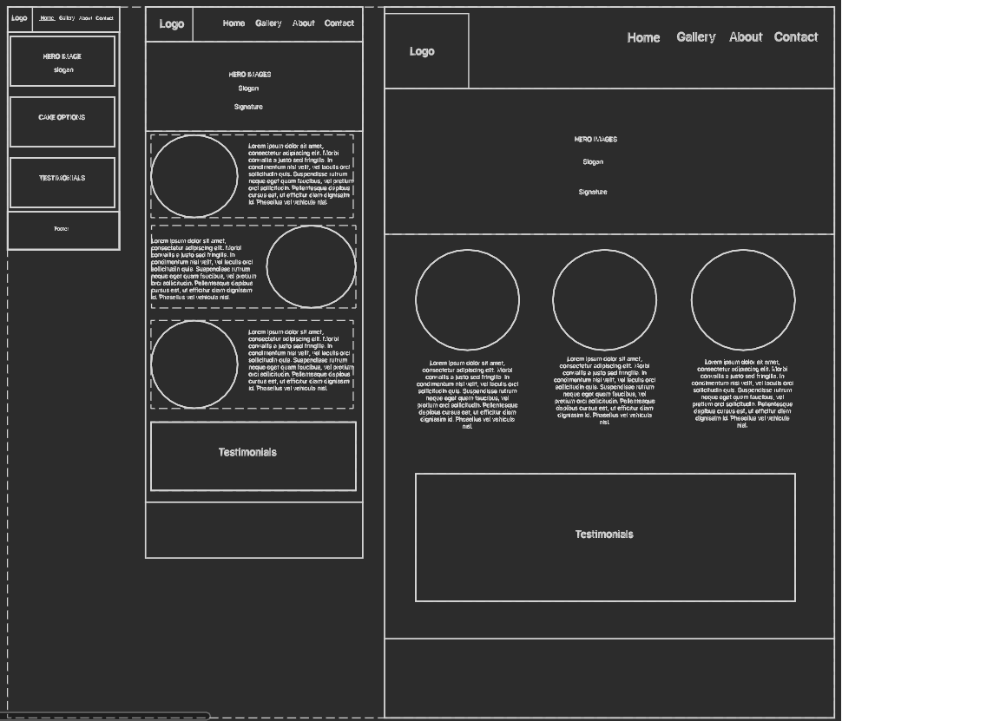
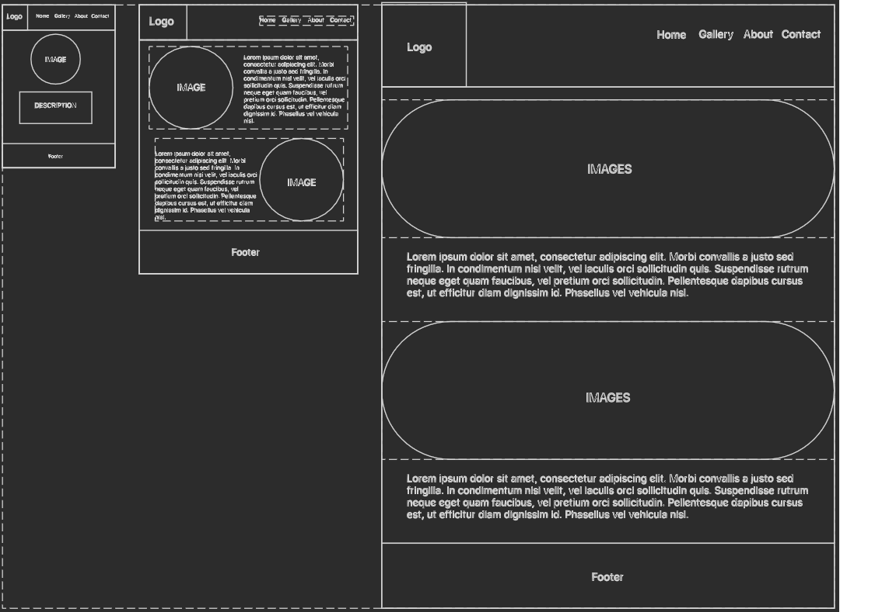

 

# Portfolio Project 1 - HTML and CSS
## Cake and Bake

### User Experience

### Strategy
#### User Stories
### Scope
### Structure

### Skelton
#### Wireframes
 

##### Index Page

 

##### About Page

 

##### Gallery Page

 

##### Form Page

 

### Surface

### Features

### Technologies
- [Canva](https://www.canva.com/) - Used to re-create Cake and Bake logos.
- [Figma](https://www.figma.com/) - Used to create wireframes for website.
- [Coolers](https://coolors.co/) - Used to create colour scheme for website.
- [Stack Overflow](https://stackoverflow.com/) - Used to troubleshoot HTML and CSS coding queries.
- [Google Fonts](https://fonts.google.com/) - Used to apply fonts to website.
- [Fontjoy](https://fontjoy.com/) - Used to create font pairings
- [Font Awesome](https://fontawesome.com/) - Used to add icons to enhance user experience.

### Testing

### Deployement

### Credits
#### Content
#### Code
#### Acknowledegements