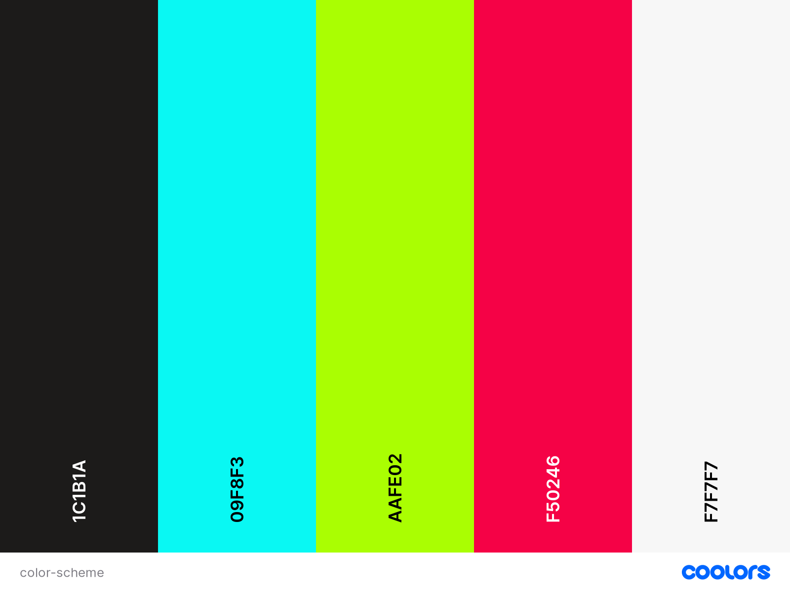

 

# __Portfolio Project 1 - HTML and CSS__
## __Cake and Bake__

Meena Rhodes is a part time baker working out of her own home in South Croydon, London, UK. She has been creating delicious delights for over a decade and built an impressive home business. She is active on [Instagram](https://www.instagram.com/cakeandbakeldn/?hl=en) and has built a following of just over 700 people. 

Meena is often asked by her clients if she has a website that can be shared with potential clients. As a result she is seeking the design and development of a functioning website that will showcase her work and allow potential clients to get in touch.

The first stage of this website will be to develop and HTML/CSS based website that meets user experience objectives set out in this document.

### __Demo__

The live site can be viewed here - [Cake & Bake](https://cmed01.github.io/Portfolio-Milestone-1/)

Github repository can be viewed here - [CMed01/Portfolio-Milestone-1](https://github.com/CMed01/Portfolio-Milestone-1)

 

## __User Experience__

### __Strategy__

The aim for this website is to provide a platform to showcase her work and grow her business. 

Reasons for the site
* Self-promotion
* Showcase successful baking projects
* To help clients get in touch with her

 

#### __User Stories__

- #### First Time Visitor Goals

    1. As a first time visitor, I want to understand main purpose of the site and learn more about the business/organisation.
    2. As a first time visitor, I want to easily navigte throughout the site to find content
    3. As a first time visitor, I want to navigate and view a menu of cakes, cupcakes and other cake related items.
    4. As a first time visitor, I want to be able to get in contact with the business.

- #### Returning Visitor Goals

    1. As a returning visitor, I want to be able to acces and view the gallery easily.
    2. As a returning visitor, I want to be able to contact the business and request a service.

- #### Frequant User Goals

    1. As a frequant user, I want to be able to access and view the gallery and the business's social media links. Both will allow me to keep up to date with new baking projects.
    2. As a frequant user, I want to be able to contact the business and request a service.

### __Scope__

Functionally, the site must be:
* easy to navigate
* well presented and display an array of successful projects showcasing the talent of the baker.

Content should include the following:
* Provide the client information about who we are and what we do.
* Showcase the variety of our work.
* Provide testimonials from our clients.
* Link to our social media pages.
* Provide a simple process to get in touch by phone, email, social media or via a contact form.

### __Structure__

Based on content required in the scope of this project, this website will consist of 4 pages

* Home page - hero image of Meena's work and description of the types of products on offer.
* About me page - action photo of Meena and information about who she is and her story behind baking.
* Gallery page - a selection of photos, ideally in sections, showcasing her work.
* Contact page - location of the business and contact form.

### __Skelton (Wireframes)__

1. #### Index Page

 

2. #### About Page

 

3. #### Gallery Page

 

4. #### Form Page

- Removed contacted section from form page as contact details present in the footer.

 

### __Surface (including Features)__

#### __Color scheme__

#### __Typography__
Three fonts were used throughout this website
1. 'Oswald' (back-up sans-serif) - used for all heading 1 and 2
2. 'Montserrat Alternates' (back-up sans-serif) - used for sll heading 3-6 and labels elements 
3. 'Biryani' (back-up sans-serif) - used for all other elements

 

#### __Features__

* Navigation bar
    - The naivgation bar has a consistent look across all pages. It contains a logo of the company and links to all the other pages in the website. The menu link of the active page contains a bottom border and when hovered a dyanmaic colour change should occur. The colour of these should be consistent with the colour scheme of the website.

 

 

* Home page
    - The home page includes a photograph with text overlay both of which simply provide an overview of the business and its goals. 

* Footer
    - The footer includes the business logo, contact details (phone, address, email) and links to all active social media pages (FaceBook and Instagram).
 

 

* About me page
    - Continued use of the colour scheme throughout. The about me page provides a action image with a biography.

 

 

* Gallery page
    - The gallery page contains stand out photos of completed baking projects, showcasing what is on offer. There is a minimum of two sections, each with at least 8 photos. The layout will be resposive initially with 2 columns on smaller screens progressing to 4 columns on larger devices.

* Contact page
    - The contact page includes an interative map of the location of the business and a contact me form.
    - The form will consist of required and optional inputs that will provide the foundation information required by the business.

* Future
    - PLEASE STATE ANY FUTURE FEATURES THAT WOULD BE GREAT TO IMPLEMENT IN THE FUTURE

 

### __Technologies__
- [Canva](https://www.canva.com/) - Used to re-create Cake and Bake logos.
- [Figma](https://www.figma.com/) - Used to create wireframes for website.
- [Coolers](https://coolors.co/) - Used to create colour scheme for website.
- [Stack Overflow](https://stackoverflow.com/) - Used to troubleshoot HTML and CSS coding queries.
- [Google Fonts](https://fonts.google.com/) - Used to apply fonts to website.
- [Fontjoy](https://fontjoy.com/) - Used to create font pairings
- [Font Awesome](https://fontawesome.com/) - Used to add icons to enhance user experience.
- [Bitly](https://app.bitly.com/) - Used to create bitly links for long URLs.

### __Testing__

### __Deployement__

### __Credits__
#### __Content__
#### __Code__
#### __Acknowledegements__

[def]: readme-attachments/navbar.png